# Splick iOS — Architecture & Technical Documentation

## Open in Xcode (required first step)

`Splick.xcodeproj` is **generated** from `project.yml` (XcodeGen) and is not in git. After clone:

```bash
cd splick-mobile-ios
make setup
# or: ./scripts/generate-xcodeproj.sh
open Splick.xcodeproj
```

If Xcode says *missing project.pbxproj*, run `make setup` again.

Requires: Xcode 15+, macOS. XcodeGen is downloaded automatically by the script (or `brew install xcodegen`).

---

## Table of Contents

1. [Product Overview](#1-product-overview)
2. [Architecture Overview](#2-architecture-overview)
3. [Module Dependency Graph](#3-module-dependency-graph)
4. [Clean Architecture Layers](#4-clean-architecture-layers)
5. [Feature Modules](#5-feature-modules)
6. [Data Flow](#6-data-flow)
7. [State Management](#7-state-management)
8. [Networking Layer](#8-networking-layer)
9. [Navigation Architecture](#9-navigation-architecture)
10. [Dependency Injection](#10-dependency-injection)
11. [Business Logic — Key Flows](#11-business-logic--key-flows)
12. [Project Structure](#12-project-structure)
13. [Tech Stack](#13-tech-stack)
14. [Development Workflow](#14-development-workflow)
15. [Simulation & Testing](#15-simulation--testing)
16. [CI/CD Pipeline](#16-cicd-pipeline)
17. [Coding Standards](#17-coding-standards)
18. [Future Roadmap](#18-future-roadmap)
19. [Localization (vi / en)](#19-localization-vi--en)

---

## 1. Product Overview

**Splick** is a hybrid Social + Financial mobile application targeting Gen Z users (18-30).

### Core Value Proposition

| Pillar | Description |
|--------|-------------|
| Social Connection | Real-time photo sharing with close friends (Locket-style) |
| Group Coordination | Friend groups for trips, events, roommates |
| Financial Collaboration | Split bills instantly, track debts, payment reminders |

### Target Users
- Students sharing apartments
- Friend groups traveling together
- Young professionals splitting meals/rides
- Roommates managing shared utilities

### Monetization
- **Free tier**: Basic social + expense splitting
- **Premium** (~30K VND/month): OCR bill scanning, analytics, unlimited groups

---

## 2. Architecture Overview

The app follows **MVVM + Clean Architecture** with **SPM Modular** packaging.

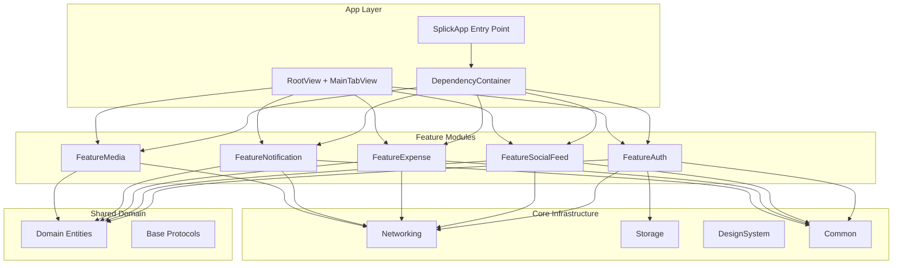

### Design Principles

1. **Strict layer separation** — Domain never depends on infrastructure
2. **Protocol-driven** — All dependencies expressed as protocols
3. **Feature isolation** — Modules communicate only via shared domain entities
4. **Unidirectional data flow** — View observes ViewModel, ViewModel calls UseCase
5. **Async/Await first** — No Combine for business logic, only for SwiftUI bindings

---

## 3. Module Dependency Graph

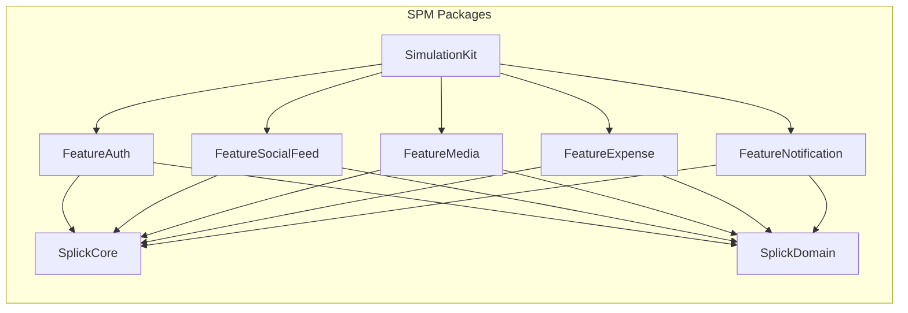

### SplickCore Sub-modules

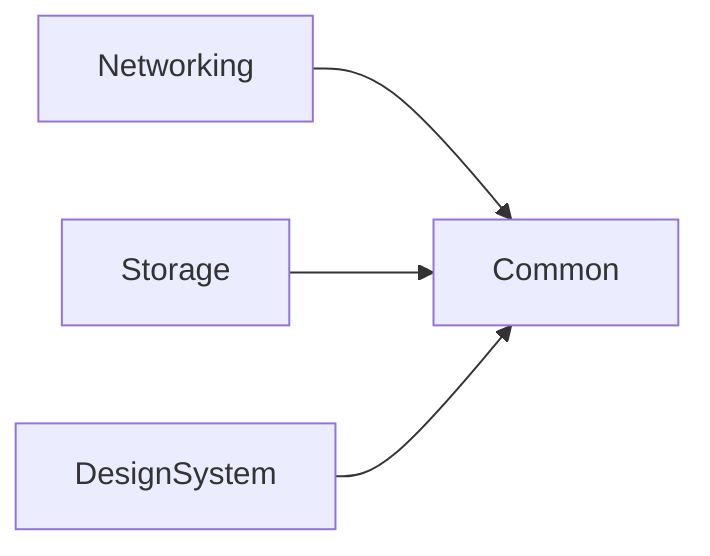

| Module | Responsibility |
|--------|---------------|
| **Common** | Errors, Constants, Logger, Extensions, LoadingState |
| **Networking** | APIClient, Endpoints, TokenProvider, JSON coding |
| **Storage** | Keychain, UserDefaults, CoreData stack |
| **DesignSystem** | Theme, Colors, Typography, Reusable UI components |

---

## 4. Clean Architecture Layers

Each feature module follows strict 3-layer Clean Architecture:

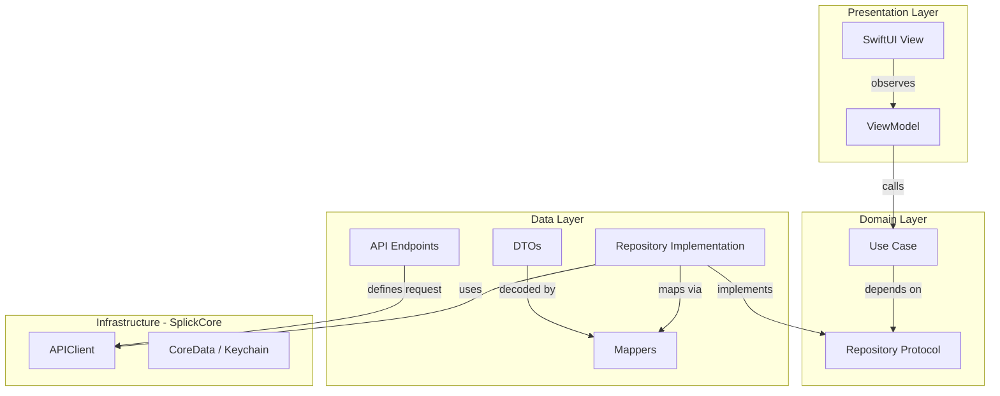

### Layer Rules (NON-NEGOTIABLE)

| Rule | Description |
|------|-------------|
| Domain has ZERO external dependencies | Only pure Swift types |
| Presentation depends on Domain only | Never imports Data layer directly |
| Data implements Domain protocols | Concrete implementations hidden behind abstractions |
| ViewModel is the boundary | Translates domain output to view-friendly state |
| No business logic in Views | Views are purely declarative |

### File Organization per Feature

```
FeatureX/
├── Domain/
│   ├── UseCases/           # Business logic
│   └── Repositories/       # Protocol definitions only
├── Data/
│   ├── DTOs/               # Network response models
│   ├── Mappers/            # DTO → Domain entity conversion
│   ├── Endpoints/          # API endpoint definitions
│   └── Repositories/       # Protocol implementations
└── Presentation/
    ├── ScreenA/
    │   ├── ScreenAView.swift
    │   └── ScreenAViewModel.swift
    └── ScreenB/
        ├── ScreenBView.swift
        └── ScreenBViewModel.swift
```

---

## 5. Feature Modules

### 5.1 FeatureAuth

**Responsibility**: User authentication, session management, token lifecycle.

| Component | Description |
|-----------|-------------|
| `LoginUseCase` | Validates credentials, creates session |
| `RegisterUseCase` | Creates account, auto-login after register |
| `LogoutUseCase` | Clears session + tokens |
| `SessionManager` | Actor-based session state holder |
| `AuthRepository` | HTTP calls + Keychain token persistence |

**API Endpoints**:
- `POST /v1/auth/login`
- `POST /v1/auth/register`
- `POST /v1/auth/refresh`
- `POST /v1/auth/logout`
- `GET /v1/auth/me`

---

### 5.2 FeatureSocialFeed

**Responsibility**: Photo feed, post reactions, comments (unlimited-depth threads + attachments), content discovery.

| Component | Description |
|-----------|-------------|
| `FetchFeedUseCase` | Paginated feed loading |
| `FetchPostUseCase` | Single post refresh (comments sync) |
| `AddCommentUseCase` | Create comment / reply with optional attachments |
| `ReactToPostUseCase` | Add emoji reaction to post |
| `FeedViewModel` | Manages feed state, pagination, reactions, comments |
| `PostCardView` | Renders individual post with image + reactions |
| `CommentThreadView` | Recursive comment tree UI |

**Docs**: [USECASE-feed-comments.md](docs/USECASE-feed-comments.md)

**API Endpoints**:
- `GET /v1/feed?page=0&limit=20`
- `GET /v1/feed/posts/{id}`
- `POST /v1/feed/posts/{id}/comments`
- `POST /v1/feed/posts/{id}/reactions`
- `DELETE /v1/feed/posts/{id}/reactions/{reactionId}`
- `POST /v1/media/uploads` (comment attachments, `purpose: COMMENT_ATTACHMENT`)

---

### 5.3 FeatureMedia

**Responsibility**: Camera capture, image upload to backend storage.

| Component | Description |
|-----------|-------------|
| `UploadMediaUseCase` | Validates size, uploads image |
| `MediaRepository` | Multipart upload via APIClient |
| `CameraView` | UIKit camera bridge (`UIImagePickerController`) |
| `CameraViewModel` | Capture state, compression, upload orchestration |

**Constraints**:
- Max image size: 10 MB
- Compression quality: 0.8
- Supported formats: JPEG, PNG, HEIC

---

### 5.4 FeatureExpense

**Responsibility**: Bill creation, split calculation, debt tracking.

| Component | Description |
|-----------|-------------|
| `CreateExpenseUseCase` | Validates input, calculates splits, creates expense |
| `FetchExpensesUseCase` | Paginated expense list |
| `FetchDebtSummaryUseCase` | Net debt per user |
| `ExpenseListView` | Shows expenses + debt summary card |
| `CreateExpenseView` | Form: amount, category, split type, participants |

**Split Types**:
- `EQUAL` — Divide total equally among participants
- `EXACT` — Custom amounts per participant (must sum to total)
- `PERCENTAGE` — Percentage-based split

**API Endpoints**:
- `GET /v1/expenses?page=0&limit=20&groupId=`
- `GET /v1/expenses/{id}`
- `POST /v1/expenses`
- `POST /v1/expenses/{id}/settle`
- `GET /v1/expenses/debts?groupId=`

---

### 5.5 FeatureNotification

**Responsibility**: Push notification display, read state management.

| Component | Description |
|-----------|-------------|
| `FetchNotificationsUseCase` | Paginated notification list |
| `MarkNotificationReadUseCase` | Mark single or all as read |
| `NotificationListView` | Shows notifications with unread badges |

**Notification Types**: `NEW_POST`, `REACTION`, `EXPENSE_CREATED`, `EXPENSE_REMINDER`, `EXPENSE_SETTLED`, `FRIEND_REQUEST`, `GROUP_INVITE`, `SYSTEM`

---

## 6. Data Flow

### Request Flow (User Action → API → UI Update)

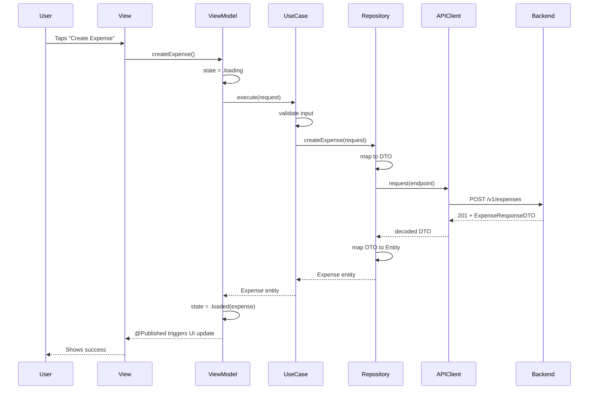

### Error Flow

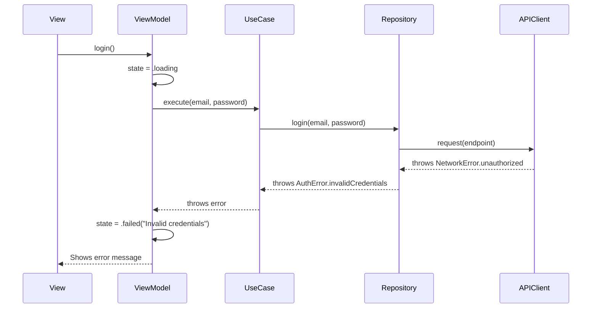

---

## 7. State Management

### State Hierarchy

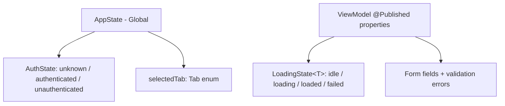

| Level | Mechanism | Scope |
|-------|-----------|-------|
| **Global** | `AppState` via `@EnvironmentObject` | Auth status, selected tab |
| **Feature** | `ViewModel` via `@StateObject` | Feature-specific data + UI state |
| **Local** | `@State` | Single-view transient state (toggles, animations) |
| **Domain** | `LoadingState<T>` enum | Typed loading/error/success |

### LoadingState Pattern

```swift
enum LoadingState<T: Equatable>: Equatable {
    case idle       // Not yet loaded
    case loading    // In progress
    case loaded(T)  // Success with data
    case failed(String) // Error with user-facing message
}
```

Every ViewModel uses this pattern for its primary data:
- `ExpenseListViewModel.state: LoadingState<[Expense]>`
- `FeedViewModel.state: LoadingState<[Post]>`
- `LoginViewModel.state: LoadingState<AuthSession>`

---

## 8. Networking Layer

### Architecture

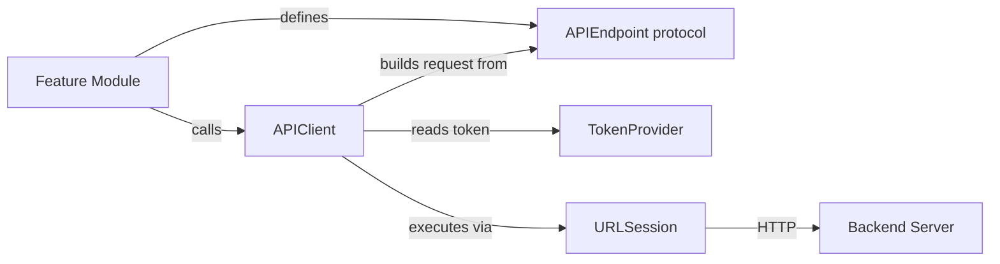

### APIEndpoint Protocol

Each feature defines its endpoints as an enum conforming to `APIEndpoint`:

```swift
protocol APIEndpoint {
    var path: String { get }
    var method: HTTPMethod { get }
    var headers: [String: String]? { get }
    var queryItems: [URLQueryItem]? { get }
    var body: Encodable? { get }
    var requiresAuth: Bool { get }
}
```

### Token Management

- Tokens stored in iOS Keychain (encrypted at rest)
- `TokenProvider` actor provides thread-safe access
- APIClient auto-injects `Authorization: Bearer <token>` for authenticated endpoints
- Refresh flow triggered on 401 response (future implementation)

### JSON Strategy

- **Decoding**: `snake_case` → `camelCase` automatic conversion
- **Encoding**: `camelCase` → `snake_case` automatic conversion
- **Dates**: ISO 8601 format with fallback parser

---

## 9. Navigation Architecture

### App-Level Routing

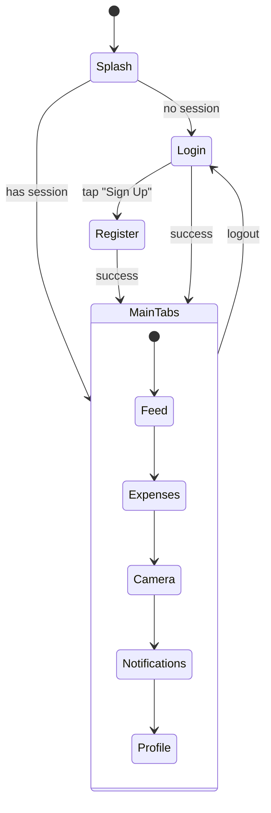

### Implementation

| Component | Role |
|-----------|------|
| `RootView` | Observes `AppState.authState`, switches between splash/auth/main |
| `MainTabView` | 5-tab `TabView` (Feed, Expenses, Camera, Notifications, Profile) |
| `NavigationStack` | Per-tab navigation (each tab owns its own stack) |

### Tab Structure

| Tab | View | Feature Module |
|-----|------|---------------|
| Feed | `FeedView` | FeatureSocialFeed |
| Expenses | `ExpenseListView` | FeatureExpense |
| Camera | `CameraView` | FeatureMedia |
| Notifications | `NotificationListView` | FeatureNotification |
| Profile | `ProfilePlaceholderView` | App (inline) |

---

## 10. Dependency Injection

### Composition Root Pattern

All dependencies are wired in `DependencyContainer` (composition root):

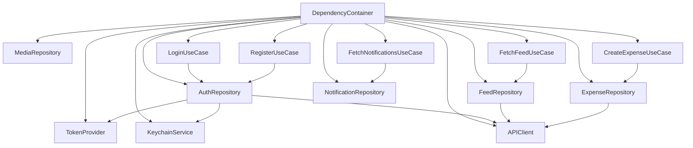

### Injection Strategy

- **DependencyContainer** is `@MainActor`, uses `lazy var` for single-instance services
- Injected into SwiftUI via `@EnvironmentObject`
- ViewModels receive use cases via constructor injection
- No service locator, no global singletons (except Container itself)

---

## 11. Business Logic — Key Flows

### 11.1 Authentication Flow

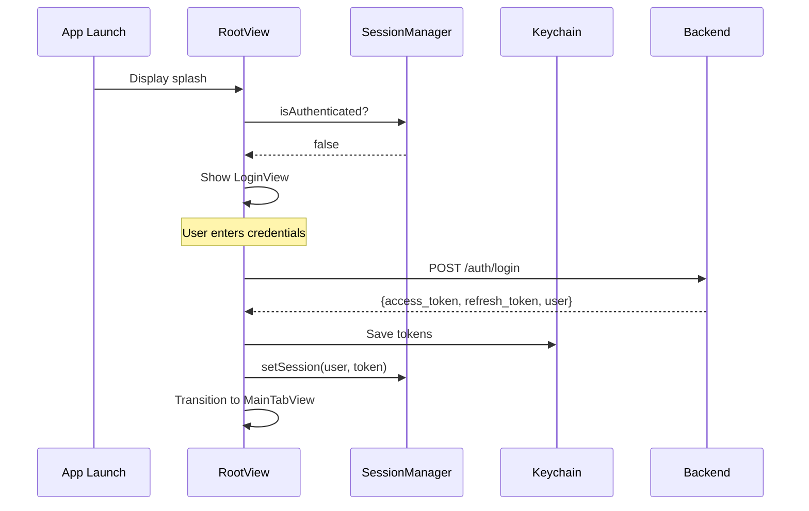

### 11.2 Expense Split Calculation

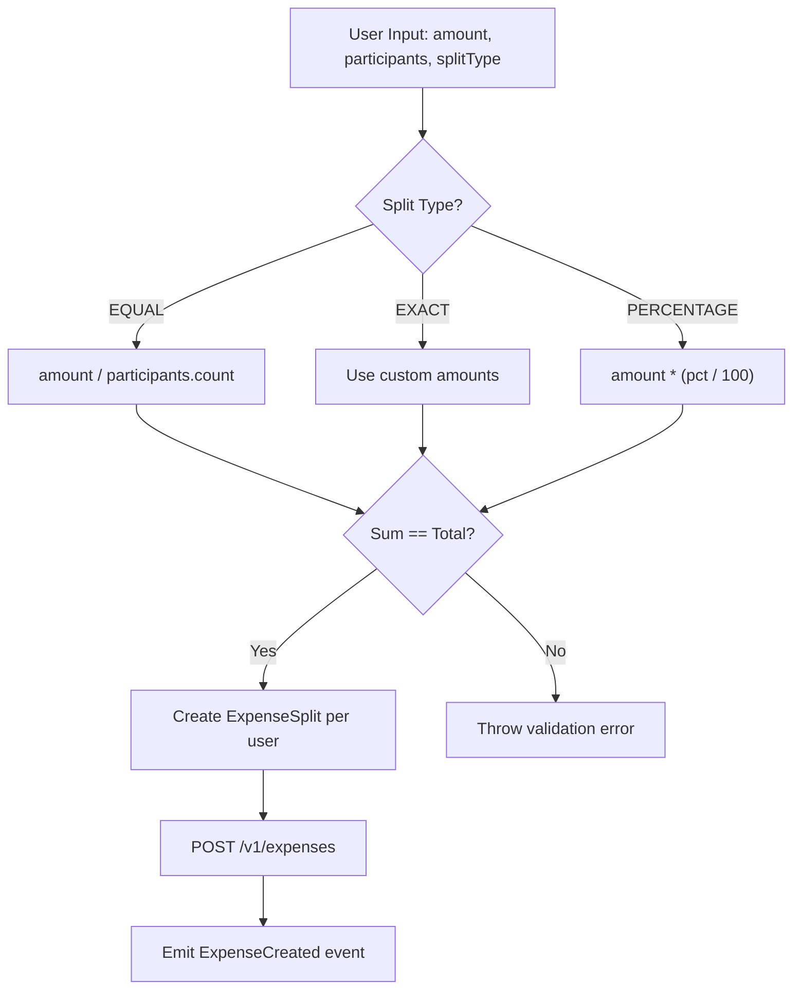

### 11.3 Feed Loading with Pagination

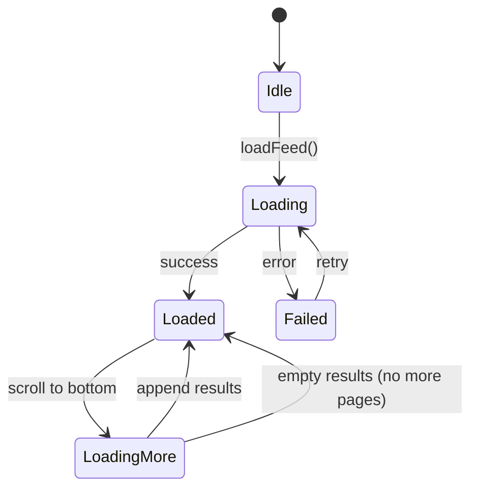

---

## 12. Project Structure

```
splick-mobile-ios/
├── .github/
│   └── workflows/
│       ├── ios-build.yml              # Build verification on push
│       └── simulation.yml             # Manual sandbox runner
│
├── Packages/
│   ├── SplickCore/                    # Core infrastructure
│   │   ├── Package.swift
│   │   └── Sources/
│   │       ├── Common/                # Errors, Constants, Logger, Extensions
│   │       ├── Networking/            # APIClient, Endpoints, TokenProvider
│   │       ├── Storage/               # Keychain, UserDefaults, CoreData
│   │       └── DesignSystem/          # Theme, UI Components, ViewModifiers
│   │
│   ├── SplickDomain/                  # Shared domain entities
│   │   ├── Package.swift
│   │   └── Sources/SplickDomain/
│   │       ├── Entities/              # User, Post, Expense, Group, Notification
│   │       ├── Protocols/             # UseCase, Repository base protocols
│   │       └── Preview/              # PreviewData (mock data for SwiftUI previews)
│   │
│   ├── FeatureAuth/                   # Authentication module
│   │   ├── Package.swift
│   │   └── Sources/FeatureAuth/
│   │       ├── Domain/UseCases/       # Login, Register, Logout
│   │       ├── Domain/Repositories/   # AuthRepositoryProtocol
│   │       ├── Domain/               # SessionManager
│   │       ├── Data/DTOs/            # Request/response models
│   │       ├── Data/Mappers/         # DTO → Entity conversion
│   │       ├── Data/Endpoints/       # AuthEndpoint enum
│   │       ├── Data/Repositories/    # AuthRepository implementation
│   │       ├── Presentation/Login/   # LoginView + LoginViewModel
│   │       ├── Presentation/Register/ # RegisterView + RegisterViewModel
│   │       └── Preview/             # Mock use cases for SwiftUI preview
│   │
│   ├── FeatureSocialFeed/             # Social photo feed
│   │   └── Sources/FeatureSocialFeed/
│   │       ├── Domain/               # FetchFeed, ReactToPost use cases
│   │       ├── Data/                 # FeedRepository, DTOs, Mappers
│   │       └── Presentation/Feed/    # FeedView, FeedViewModel, PostCardView
│   │
│   ├── FeatureMedia/                  # Camera & upload
│   │   └── Sources/FeatureMedia/
│   │       ├── Domain/               # UploadMedia use case
│   │       ├── Data/                 # MediaRepository, endpoints
│   │       └── Presentation/Camera/  # CameraView, CameraViewModel, ImagePicker
│   │
│   ├── FeatureExpense/                # Bill splitting
│   │   └── Sources/FeatureExpense/
│   │       ├── Domain/               # CreateExpense, FetchExpenses, FetchDebt
│   │       ├── Data/                 # ExpenseRepository, DTOs, Mappers
│   │       └── Presentation/         # ExpenseListView, CreateExpenseView
│   │
│   ├── FeatureNotification/           # Notifications
│   │   └── Sources/FeatureNotification/
│   │       ├── Domain/               # FetchNotifications, MarkRead
│   │       ├── Data/                 # NotificationRepository
│   │       └── Presentation/         # NotificationListView
│   │
│   └── SimulationKit/                 # Dev/testing sandbox (Windows-friendly)
│       ├── Package.swift
│       └── Sources/
│           ├── SimulationKit/         # MockAPIClient, StateLogger, Fakes
│           └── Sandbox/              # CLI executable for flow simulation
│
├── SplickApp/                         # Main iOS app target
│   ├── Sources/
│   │   ├── App/SplickApp.swift       # @main entry point
│   │   ├── DI/DependencyContainer.swift  # Composition root
│   │   └── Navigation/              # AppState, RootView, MainTabView
│   └── Resources/                    # Assets, Info.plist
│
├── api-stubs/                         # Offline JSON mock server
│   ├── db.json                       # Full mock dataset
│   ├── routes.json                   # URL route mapping
│   └── README.md                     # Setup instructions
│
├── project.yml                        # XcodeGen project definition
├── Makefile                           # Build automation
└── .gitignore
```

---

## 13. Tech Stack

| Category | Technology | Version |
|----------|-----------|---------|
| Language | Swift | 5.9+ |
| Min iOS | iOS | 16.0 |
| UI Framework | SwiftUI | - |
| Async | async/await | Swift Concurrency |
| Package Manager | SPM (local packages) | - |
| Project Gen | XcodeGen | latest |
| Offline Storage | CoreData | - |
| Secure Storage | Keychain Services | - |
| Networking | URLSession (native) | - |
| CI/CD | GitHub Actions (macOS runner) | - |
| Backend | Spring Boot (Java 21) | - |
| Database | PostgreSQL | - |
| Cache | Redis | - |

### No External Dependencies

The project uses **zero third-party dependencies** by design:
- Native `URLSession` instead of Alamofire
- Native `JSONDecoder` instead of SwiftyJSON
- Native `AsyncImage` instead of Kingfisher/SDWebImage
- CoreData instead of Realm

This ensures:
- No supply chain risk
- No version conflicts
- No binary size bloat
- Full control over all abstractions

---

## 14. Development Workflow

### Windows-First Strategy

Since primary development happens on Windows (no Xcode available):

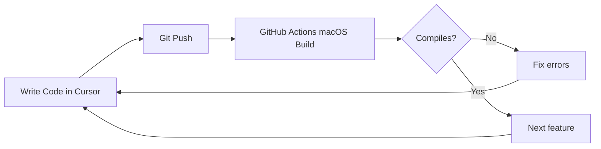

### Adding a New Feature

1. **Define domain entities** in `SplickDomain/Entities/`
2. **Define repository protocol** in `Feature/Domain/Repositories/`
3. **Implement use case** in `Feature/Domain/UseCases/`
4. **Create DTOs** in `Feature/Data/DTOs/`
5. **Create mapper** in `Feature/Data/Mappers/`
6. **Define endpoint** in `Feature/Data/Endpoints/`
7. **Implement repository** in `Feature/Data/Repositories/`
8. **Create ViewModel** in `Feature/Presentation/`
9. **Create View** in `Feature/Presentation/`
10. **Wire in DependencyContainer**
11. **Add fake repository** in `SimulationKit/Fakes/`
12. **Add simulation** in `Sandbox/main.swift`

---

## 15. Simulation & Testing

### SimulationKit

A development-time package that provides:
- `MockAPIClient` — Configurable fake HTTP client
- `MockTokenProvider` — In-memory token storage
- `MockKeychainService` — In-memory secure storage
- `StateLogger` — Console-based state transition logging
- `FakeXxxRepository` — In-memory implementations for each feature

### Live APIs (app) vs SimulationKit (CLI)

The main app always uses live HTTP APIs via `DependencyContainer` (feed, expense, notification, auth, media). **SimulationKit** fakes remain for the Sandbox CLI and SwiftUI previews only.

Changing profile avatar requires `runAuth` + `runMedia` and a real `SHARED_MEDIA_PUBLIC_BASE_URL` on the backend — see [docs/USECASE-change-user-avatar.md](docs/USECASE-change-user-avatar.md).

### Sandbox CLI

Run feature flow simulations from terminal:

```bash
# On macOS (or via GitHub Actions)
cd Packages/SimulationKit
swift run Sandbox auth       # Simulate auth flows
swift run Sandbox feed       # Simulate feed loading
swift run Sandbox expense    # Simulate expense splitting
swift run Sandbox full       # Full user journey
swift run Sandbox all        # Run everything
```

Example output:
```
[14:30:01.234] [Auth.Login] ▶ SIMULATION: Login Flow
────────────────────────────────────────────────────────────
[14:30:01.235] [Auth.Login] Scenario 1: Valid credentials
[14:30:01.536] [Auth] Login attempt: test@splick.app
[14:30:01.837] [Auth] ✓ Login successful: namtran
[14:30:01.838] [Auth.Login] ✓ Logged in as: @namtran
[14:30:01.838] [Auth.Login] Token: fake-access-a1b2c3d4...
```

### Testing Layers

| Layer | Test Type | Can run on Windows? |
|-------|-----------|-------------------|
| Domain (UseCases) | Unit tests via Sandbox | Yes (simulation) |
| Data (Mappers) | Unit tests | Yes (pure logic) |
| Data (Repositories) | Integration via Sandbox | Yes (with fakes) |
| Presentation (ViewModels) | State simulation | Yes (via StateLogger) |
| Presentation (Views) | SwiftUI Preview | No (requires Xcode) |

---

## 16. CI/CD Pipeline

### Build Verification (every push)

```yaml
# .github/workflows/ios-build.yml
- Generate Xcode project (xcodegen)
- Resolve SPM dependencies
- Build for iOS Simulator
- Build SimulationKit
```

### Simulation Runner (manual trigger)

```yaml
# .github/workflows/simulation.yml
- Build Sandbox executable
- Run selected simulation
- Print flow output
```

### Future (when Apple Developer account available)

```
Push → Build → Test → Archive → TestFlight → iPhone/iPad
```

---

## 17. Coding Standards

### Naming

| Type | Convention | Example |
|------|-----------|---------|
| Use Case | `VerbNounUseCase` | `CreateExpenseUseCase` |
| Repository Protocol | `XxxRepositoryProtocol` | `AuthRepositoryProtocol` |
| ViewModel | `ScreenNameViewModel` | `LoginViewModel` |
| View | `ScreenNameView` | `LoginView` |
| DTO | `NounDTO` / `NounRequestDTO` | `LoginRequestDTO` |
| Mapper | `FeatureMapper` | `AuthMapper` |
| Endpoint | `FeatureEndpoint` | `AuthEndpoint` |

### Architecture Rules

- Maximum function length: 30-50 lines
- Maximum class length: 200 lines
- No business logic in Views
- No direct API calls from ViewModels (must go through UseCase)
- All external dependencies behind protocols
- No cross-module entity sharing (only via SplickDomain)
- Errors must be domain-specific (not generic `Error`)

### Swift Style

- `async/await` over Combine for business logic
- `actor` for thread-safe mutable state
- `Sendable` conformance for all domain types
- `@MainActor` for ViewModels
- Explicit access control (`public`, `internal`)
- No force unwraps except URL literals with known-valid strings

---

## 18. Future Roadmap

### Phase 1 — MVP (Current)
- [x] Modular architecture setup
- [x] Core infrastructure (Networking, Storage, DesignSystem)
- [x] Auth feature (Login/Register)
- [x] Social feed (posts + reactions)
- [x] Expense splitting
- [x] Notifications
- [x] Camera/upload
- [x] SimulationKit for Windows dev
- [ ] Real backend integration testing
- [ ] CI build passing

### Phase 2 — Polish
- [ ] Offline-first with CoreData cache
- [ ] Token refresh rotation
- [ ] Real-time updates (WebSocket)
- [ ] Group management feature
- [ ] Profile editing
- [ ] Image caching layer
- [ ] Pull-to-refresh animations
- [ ] Haptic feedback

### Phase 3 — Scale
- [ ] OCR bill scanning (Premium)
- [ ] Expense analytics dashboard
- [ ] Smart split suggestions
- [ ] Widget support (iOS 17+)
- [ ] App Clips for quick expense sharing
- [x] Localization (Vietnamese + English) — see [docs/localization-ios.md](docs/localization-ios.md)

---

## 19. Localization (vi / en)

In-app copy uses `SplickCore/Localization` (`L10nKey`, `LanguageService`, one Swift file per locale). System permission dialogs use `InfoPlist.strings` under `SplickApp/Resources/{en,vi}.lproj/`.

**Adding a string or a new language:** [docs/localization-ios.md](docs/localization-ios.md)

Quick usage:

```swift
Text(languageService.text(.expenseTitle))
```

User language is chosen in Profile, persisted locally, synced via `preferredLocale` API, and sent as `Accept-Language` on HTTP requests.

---

## Backend Integration

The iOS app connects to a **Java Spring Boot modular monolith** backend:

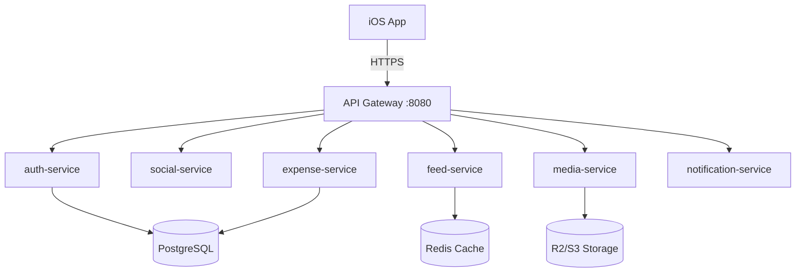

### API Contract

- Base URL: `http://localhost:8080/api` (dev) / `https://api.splick.app/api` (prod)
- Auth: `Authorization: Bearer <JWT>`
- Format: JSON with `snake_case` keys
- Pagination: `?page=0&limit=20`
- Errors: Standardized error response with `message` field

---

*Last updated: 2026-05-17*
